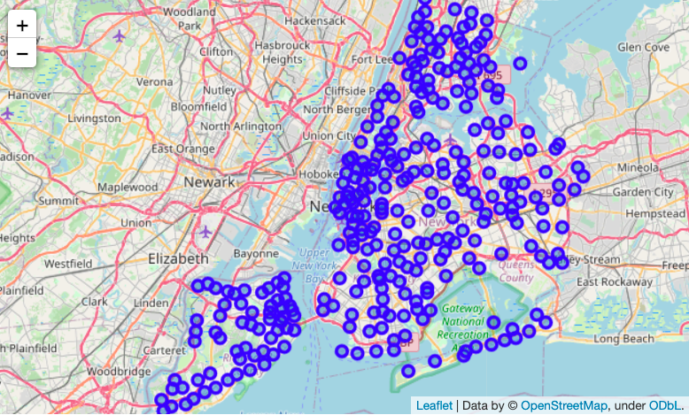
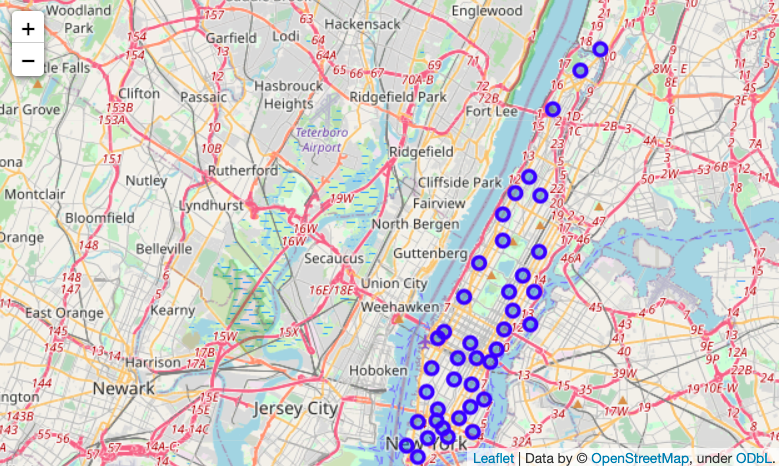
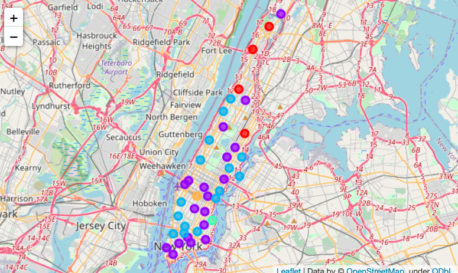

# battle-of-neighborhoods-in-manhattan

### About Manhattan

`Manhattan` is a major central city for diversity since many people from different cultural atmospheres have brought their families and dreams to Manhattan. The city has consistently seen people from around the world move to the city and call it home. It has been a center for trade and economic growth. Manhattan is known world wide as a cultural melting pot. While other states have had immigration surges, none have compared to the diversity and sheer number of immigrants that have made their way to the City. So these number of varies cultures combined to create a great diversity for itself. Since People from all over the world tend to come up here, we can see some many of their cultural aspects Transport, Food, Clothing, and so on…

### Problem Description

`Restaurant` is a place where people come to have food and drinks for a cost, People love to do many things and try something new or stick with their own routines, it depends on the individual and there are so many of them with different cultural and various aspects in Manhattan. There are so many cuisines, which is based on the style of cooking, the ingredients, dishes and techniques. For our problem lets stick with Indian cuisine.

> Let’s assume in this one of the world’s most diverse region we want to open an Indian restaurant, so what are all the factors we have to take into account such as follows,

- Market Places
- Competition in particular location
- Aiding places that make people come to restaurants like Gym, \* Entertaining Public places
- Population
- Menu from competitors
  > And so on… So our solution needs to be data driven for avoiding or considering low risk criteria and high success rate and thus apply our overall knowledge in the techniques and the tools gained so far in this course.

Here `FourSquare APIs` are used to explore neighbourhoods in Manhattan. To get started with `FourSquare APIs` follow the official 🗺 [guide](https://developer.foursquare.com/docs/places-api/getting-started/)

## Getting started

The [notebook](https://www.kaggle.com/akashsdas/battle-of-neighbourhood-in-manhattan) is available on Kaggle to work in the same environment where this notebook was created i.e. use the same version packages used, etc...

You'll also need `Foursquare API` credentials, the keys below are not functional after this notebook is made public. You can create your own Foursquare API keys by following the `official` [guide](https://developer.foursquare.com/docs/places-api/getting-started/).

## Findings and Clusters

**Looking at a subset of FourSquare API**

```json
{
  "reasons": {
    "count": 0,
    "items": [
      {
        "reasonName": "globalInteractionReason",
        "summary": "This spot is popular",
        "type": "general"
      }
    ]
  },
  "referralId": "e-0-4b4429abf964a52037f225e3-0",
  "venue": {
    "categories": [
      {
        "icon": {
          "prefix": "https://ss3.4sqi.net/img/categories_v2/food/pizza_",
          "suffix": ".png"
        },
        "id": "4bf58dd8d48988d1ca941735",
        "name": "Pizza Place",
        "pluralName": "Pizza Places",
        "primary": true,
        "shortName": "Pizza"
      }
    ],
    "delivery": {
      "id": "72548",
      "provider": {
        "icon": {
          "name": "/delivery_provider_seamless_20180129.png",
          "prefix": "https://fastly.4sqi.net/img/general/cap/",
          "sizes": [40, 50]
        },
        "name": "seamless"
      },
      "url": "https://www.seamless.com/menu/arturos-pizza-5189-broadway-ave-new-york/72548?affiliate=1131&utm_source=foursquare-affiliate-network&utm_medium=affiliate&utm_campaign=1131&utm_content=72548"
    },
    "id": "4b4429abf964a52037f225e3",
    "location": {
      "address": "5198 Broadway",
      "cc": "US",
      "city": "New York",
      "country": "United States",
      "crossStreet": "at 225th St.",
      "distance": 240,
      "formattedAddress": [
        "5198 Broadway (at 225th St.)",
        "New York, NY 10463",
        "United States"
      ],
      "labeledLatLngs": [
        {
          "label": "display",
          "lat": 40.87441177110231,
          "lng": -73.91027100981574
        },
        {
          "label": "entrance",
          "lat": 40.874401,
          "lng": -73.910339
        }
      ],
      "lat": 40.87441177110231,
      "lng": -73.91027100981574,
      "postalCode": "10463",
      "state": "NY"
    },
    "name": "Arturo's",
    "photos": {
      "count": 0,
      "groups": []
    }
  }
}
```

**Top 5 venues at a place**

```bash
==== 🚨 Battery Park City 🚨 ====
            venue  freq
0            Park  0.08
1     Coffee Shop  0.06
2  Clothing Store  0.05
3             Gym  0.05
4   Memorial Site  0.04

==== 🚨 Carnegie Hill 🚨 ====
         venue  freq
0  Coffee Shop  0.08
1         Café  0.05
2          Bar  0.04
3  Yoga Studio  0.03
4    Wine Shop  0.03

==== 🚨 Central Harlem 🚨 ====
                  venue  freq
0    African Restaurant  0.07
1    Seafood Restaurant  0.04
2                   Bar  0.04
3  Gym / Fitness Center  0.04
4   Fried Chicken Joint  0.04

==== 🚨 Chelsea 🚨 ====
                 venue  freq
0          Coffee Shop  0.07
1          Art Gallery  0.05
2               Bakery  0.05
3   Italian Restaurant  0.04
4  American Restaurant  0.04

==== 🚨 Chinatown 🚨 ====
                venue  freq
0  Chinese Restaurant  0.08
1              Bakery  0.07
2        Dessert Shop  0.04
3        Cocktail Bar  0.04
4   Hotpot Restaurant  0.04

==== 🚨 Civic Center 🚨 ====
```

**Clusters**







## License

[APACHE LICENSE, VERSION 2.0](./LICENSE)
